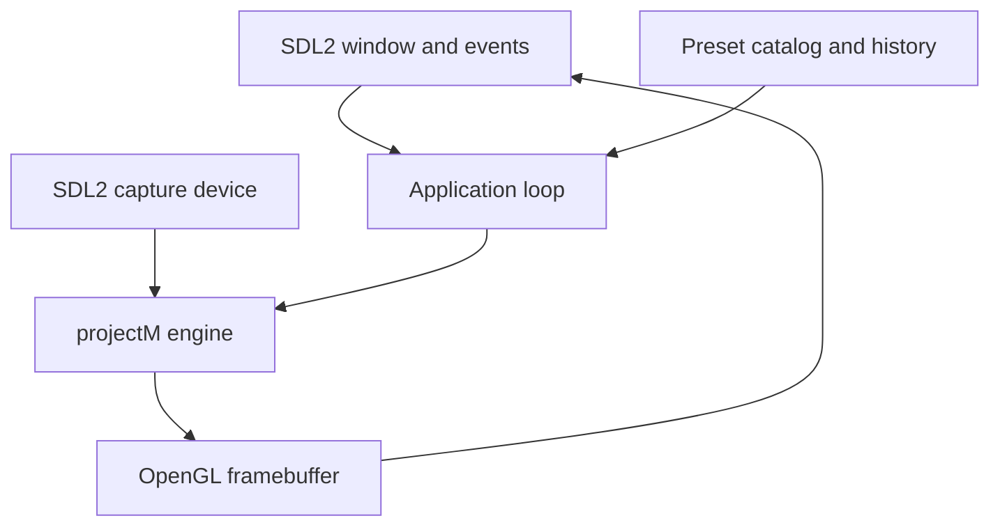

# Architecture

## Design goals

The application is deliberately a native Linux frontend rather than a Windows compatibility wrapper. Platform-specific
services are isolated so the MilkDrop compatibility work can progress without entangling rendering, audio, and desktop
integration.

## Runtime flow

## Components

| Component | Responsibility |
|---|---|
| `Config` | XDG configuration, environment path expansion, CLI parsing, and validation |
| `PresetCatalog` | Recursive discovery, deduplication, shuffle/order, and 1,000-entry playback history |
| `AudioCapture` | SDL capture-device discovery, selection, cycling, and floating-point PCM delivery |
| `ProjectMEngine` | RAII wrapper for libprojectM configuration, PCM input, preset loading, and rendering |
| `Application` | SDL/OpenGL lifecycle, events, drag-and-drop, controls, frame pacing, and status title |

## Dependency boundary

`milkdrop3_core` has no graphical or audio dependencies and is unit-tested independently. The executable adds SDL2,
OpenGL, and libprojectM 4. This split keeps configuration and preset behavior testable on headless CI runners.

## Audio

SDL requests interleaved 48 kHz stereo `float32` capture samples and forwards them from its audio callback to
`projectm_pcm_add_float()`. PipeWire and PulseAudio expose desktop-output monitor sources as capture devices. Direct
PipeWire stream selection is reserved for a later milestone.

## MilkDrop3 compatibility strategy

Standard presets are rendered by libprojectM. `.milk2` support will use two independently rendered projectM surfaces and
a native OpenGL compositor implementing MilkDrop3 blending patterns. Features requiring access to preset execution
state, such as deep mash-up bins or expanded `q` variables, may require an upstreamable libprojectM extension rather
than private renderer duplication.

