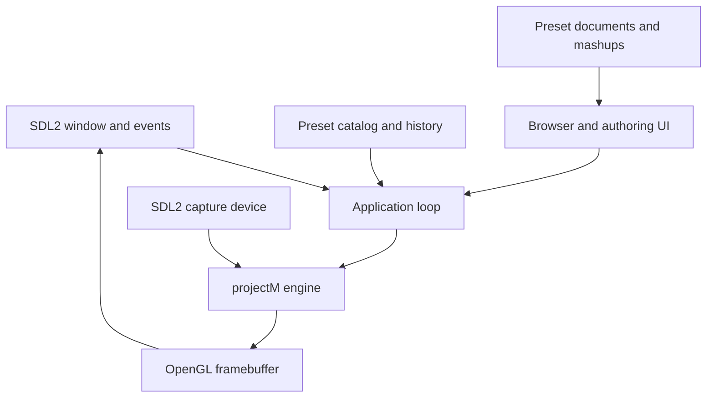

# Architecture

## Design goals

The application is deliberately a native Linux and Apple Silicon frontend rather than a Windows compatibility wrapper.
Platform-specific services are isolated so the MilkDrop compatibility work can progress without entangling rendering,
audio, and desktop integration.

## Runtime flow

## Components

| Component | Responsibility |
|---|---|
| `Config` | XDG/Linux and Application Support/macOS paths, environment expansion, CLI parsing, and validation |
| `PresetCatalog` | Recursive discovery, deduplication, shuffle/order, and 1,000-entry playback history |
| `PresetLibrary` | Persistent ratings, favorites, play counts, and weighted-selection metadata |
| `PresetDocument` | Loss-aware `.milk` parsing, serialization, classification, and diagnostics |
| `MashupEngine` | Selective preset composition and collision-free generated output paths |
| `GeneratedPresetStore` | Generated-directory ownership checks, safe rename, and recoverable move-to-trash |
| `OverlayManager` | Bounded, expiring status and error messages |
| `AudioCapture` | SDL capture-device discovery, selection, cycling, and floating-point PCM delivery |
| `ProjectMEngine` | RAII wrapper for libprojectM configuration, PCM input, preset loading, and rendering |
| `UiController` | Dear ImGui browser/editor, playlists, mashups, and SDL_image/OpenGL overlays |
| `Application` | SDL/OpenGL lifecycle, events, drag-and-drop, controls, frame pacing, and status title |

## Dependency boundary

`milkdrop3_core` has no graphical or audio dependencies and is unit-tested independently. The executable adds SDL2,
SDL2_image, Dear ImGui, OpenGL, and libprojectM 4. This split keeps configuration, preset documents, mashups, library
metadata, playlists, and selection behavior testable on headless CI runners.

## Platform layer

Linux builds request an OpenGL 3.3 core context and use XDG data/configuration locations. Apple Silicon builds are
arm64-only application bundles, request Apple's native OpenGL 4.1 core profile, use SDL2main for Cocoa lifecycle
integration, and store mutable data under `~/Library/Application Support/MilkDrop3 Native`. Both platforms use the same
renderer, editor, preset catalog, and audio abstraction.

The macOS install step uses CMake BundleUtilities to copy non-system dynamic dependencies into
`Contents/Frameworks`, rewrite Mach-O install names, and sign the resulting bundle. Its Info.plist declares the
microphone usage reason and an audio-input entitlement is included for hardened Developer ID signing.

## Authoring and mashups

The editor parses preset text into a `PresetDocument` while preserving unknown keys and comments. It reports malformed
lines, duplicate keys, and gaps in numbered equation/shader blocks before passing data to libprojectM. Mashups replace
only explicitly selected domains and then call `projectm_load_preset_data()`. Generated files are written to a separate
platform data directory so community presets are never overwritten. Rename and removal controls are exposed only for
files owned by that directory; removal moves files into its hidden `.trash` directory, which catalog scans skip.

The six domains correspond to the useful portions of MilkDrop 2's historical state model: general post-processing,
motion and equations, waves, shapes, warp shader, and composite shader. No Win32, D3D9, Wasabi, or legacy NS-EEL code is
used.

## Audio

SDL requests interleaved 48 kHz stereo `float32` capture samples and forwards them from its audio callback to
`projectm_pcm_add_float()`. PipeWire and PulseAudio expose desktop-output monitor sources on Linux. macOS exposes
microphones and virtual capture devices; system-output visualization requires a virtual driver such as BlackHole or
Loopback. Direct PipeWire stream selection is reserved for a later milestone.

## MilkDrop3 compatibility strategy

Standard presets are rendered by libprojectM. `.milk2` support will use two independently rendered projectM surfaces and
a native OpenGL compositor implementing MilkDrop3 blending patterns. Features requiring access to live preset execution
state or expanded variables may require an upstreamable libprojectM extension rather than private renderer duplication.
